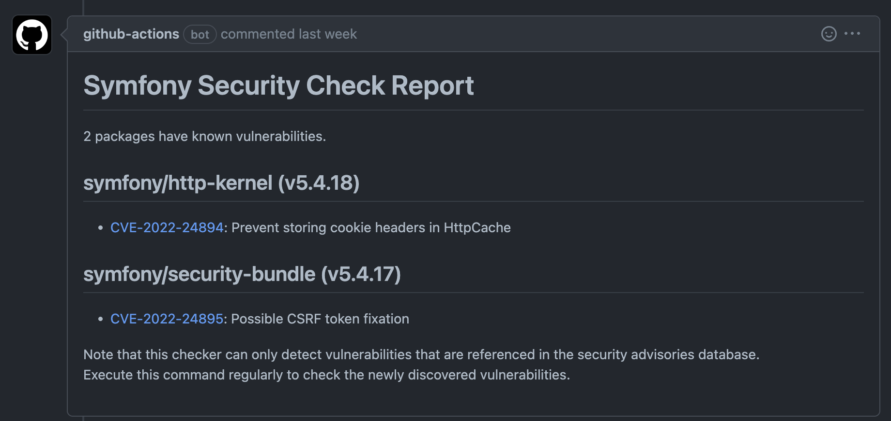

# README

## Description

This Github Action launch Symfony CLI `check:security` on your project on all PR (to `dev` and `master` branches) and generate a report that list all known security vulnerabilities.  

More informations: https://symfony.com/doc/current/setup.html#checking-security-vulnerabilities



## Usage

Path: `.github/workflows/security.yml`
```yaml
name: Security

on:
  pull_request:
    branches: [dev, master]

jobs:
  security:
    uses: fulll/actions/php-security-check/security.yml@master
```
